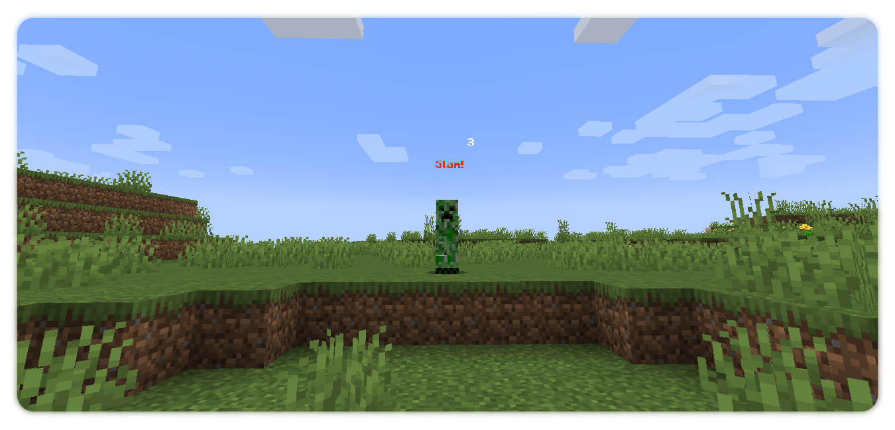

### Ouch!

---

A simple damage indicators mod. This was more of an experimental project than something I made for people to use, but I figure somebody might enjoy using it!
Entities that are hurt will display a popup message detailing the damage taken, and fun damage markers ("Bam", "Whack", "Pow!") will occasionally appear.

Required on the client & server for damage accuracy purposes. Fabric 1.17.1.

### License

MIT.
